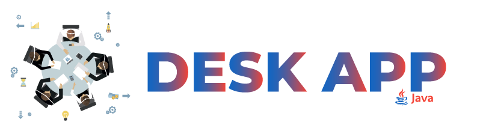

<p align="center" id="top">
  
</p>

<p align="center">
    <em>This repository contains the srcs of a Desktop app</em>
</p>

<p align="center">
  <a href="https://ez7mz.me" target="_blank">
        
  </a>&emsp;
  <a href="https://ensak.usms.ac.ma/ensak/" target="_blank">
        
  </a>&emsp;
  <a href="https://www.linkedin.com/in/ez7mz/" target="_blank">
    
  </a>&emsp;
  <a href="https://www.instagram.com/ez7m.z/" target="_blank">
    
  </a>
</p>

---
<br>

# 💬 Description
The project is about building a Web app to manage students.<br>
⚠️ `it's just an application to basic interactions with database using PHP.`

<br>

# 🧮 Build with
<p align="left">
    &emsp;
    &emsp;
    &emsp;
    &emsp;
    &emsp;
</p>

<br>

# How to get Documents
<div class="termy">

```console
$ git clone https://github.com/ez7mz/Web-App-Student-Management.git

---> 100%
```

</div>
<p align="left">
    <a href="#top">
        [Back to top]
    </a>
</p>

---

<p align="right">
    <a href="https://ez7mz.me/">&copy; ez7mz 2022</a>
</p>
 
